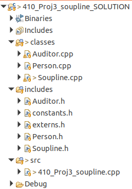
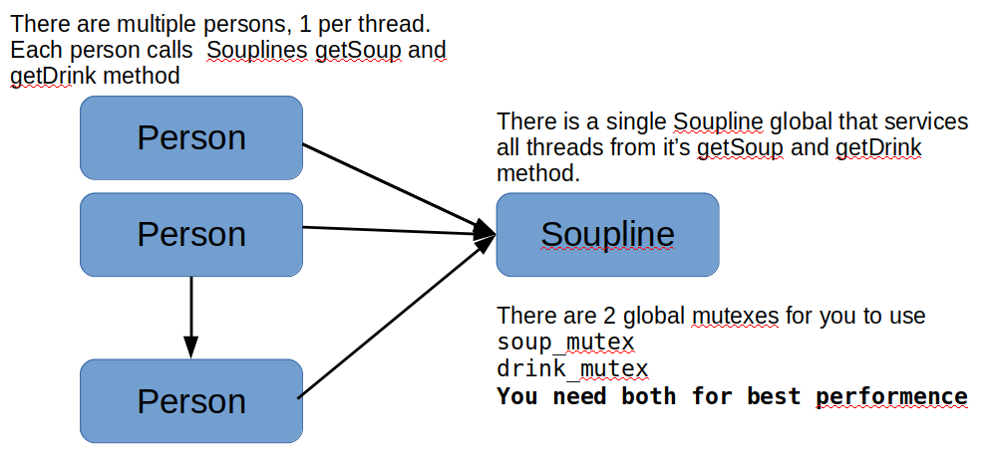

**CPSC 410**

**Project 3**

## Motivation: Topics covered by this project;

-   Mutexes, Threads

-   Finding and protecting critical sections

## Overview

You have been provided with a project with the following structure:

This project simulates a soupline, where multiple people (1 per thread)
go to a soupline (a global variable) to get a bowl of soup and a drink
(see below).

They continue getting soup and drinks until the soupline runs out of
both.

The project requires the soupline to be fair for both soup and drinks.
That is if personA is trying to get a bowl of soup and they already have
had 2 bowls, and personB has had only 1 bowl, then personA must wait
until PersonB catches up.

## Directions

Most content is given to you except for Person.cpp and Soupline.cpp.
Please complete these files according to the api provided in the
respective header files. Please identify the smallest critical sections
and protect them with mutexes supplied in 410_proj3_soupline.cpp.

**Note:** You are given 2 mutexes for a reason. If you use them
correctly then 1 thread can be getting a drink while another thread is
simultaneously getting soup.

**Note:** externs.h must be \#included in Person.cpp and Soupline.cpp in
order for the linker to find these mutexes.

## Instructions:

Please fork this projct to your GitLab account.  Then clone to your local machine.  Please commit all changes to your fork in GitLab. **To grade, I will pull your Gitlab repository and evaluate the following 2 files only.  
Person.cpp  
Soupline.cpp**

## Due Date
Project is due 4/2/22.  

## Teams

Individual effort for this project.

## Grading

There is a built in tester. If everything runs correctly you will see

total points=100

in the last statement.

**I will also check to verify that both mutexes provided are being used
correctly (10 points) and that you have the smallest possible critical
sections (10 points).**
